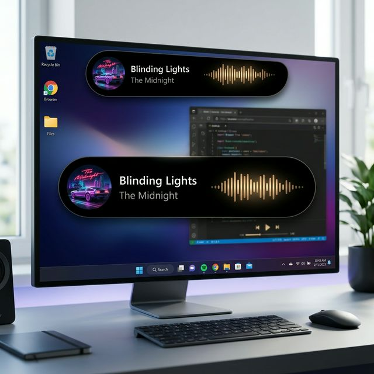
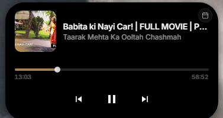
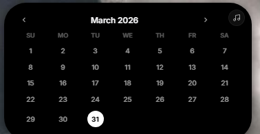

# 🏝️ WinIsland

A premium, interactive Dynamic Island experience for Windows. Inspired by the iPhone, built for your desktop.

<p align="center">
  
  
  
</p>

## ✨ Features

- **Multi-Monitor Support**: Detects and pins an island to the top of every connected display.
- **Always-On-Top**: Stays above all apps (even in fullscreen where possible).
- **Media Intelligence**:
  - Automatically detects media from **Spotify**, **Apple Music**, **Edge**, **Chrome**, etc.
  - **Premium Artwork Extraction**: Uses .NET Reflection to bypass WinRT limitations, ensuring artwork is visible even when the source app is finicky.
  - **Dynamic Color Sync**: The island glow and waveform match the dominant color of the current album art.
  - **Interactive Seekbar**: Drag and scrub through your music in real-time.
  - **One-Click Launch**: Click the album art to immediately open the source music app.
- **Calendar Integration**: A clean, monthly grid view with today's date highlighting and event indicators.

## 🚀 Quick Start

The fastest way to get started is to use the provided runner:

1.  Clone the repository or download the source.
2.  Double-click **`winsland.bat`**.
3.  Enjoy your island! 🏝️

## 🛠️ Manual Installation

If you prefer to install manually:

```bash
# Install dependencies
npm install

# Start the dev server
npx vite

# In another terminal, start Electron
set NODE_ENV=development
npx electron .
```

## ⌨️ Controls

- **Click Capsule**: Expand the island to view media controls or calendar.
- **Hover**: Enables interaction; mouse events are ignored on transparent areas when the island is collapsed.
- **Click Outside**: Automatically collapses the expanded island back into its minimal pill state.
- **Top-Right Button**: Toggle between Music Player and Calendar views.

## 📦 Building for Production

<details>
<summary><b>Click to view Build Instructions</b></summary>

### 🛠️ Prerequisites
- [Node.js](https://nodejs.org/) installed.
- Run `npm install` to set up dependencies.

### 🧪 Test Build (Unpacked)
For a quick test without creating a full installer:
```bash
npm run pack
```
- **EXE Location**: `dist-electron/win-unpacked/WinIsland.exe`
- *Note: This creates a folder containing the raw app files—great for quick testing!*

### 🚢 Production Build (Installer)
To create a professional, distributable installer:
```bash
npm run dist
```
- **EXE Location**: `dist-electron/WinIsland Setup 1.0.0.exe`
- *Note: This generates a single `.exe` installer (via NSIS) that installs the app to Program Files.*

</details>

## 🏗️ Tech Stack

<details>
<summary>Click to view technologies used</summary>

- **Electron**: Desktop shell and OS integration.
- **React + Vite**: Frontend UI.
- **Framer Motion**: Smooth, spring-based animations.
- **PowerShell (v5.1+)**: Interfacing with the Windows System Media Transport Controls (SMTC) API.

</details>

---
*Inspired by the future of multitasking. Built for productivity.*
